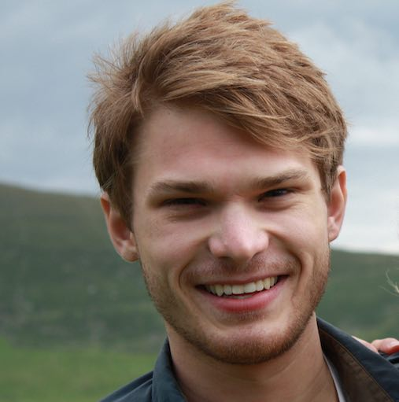

  

    
  

  

    I’m a Philosophy PhD student at UC Berkeley, working primarily in philosophy of mind, epistemology, and philosophy of science.
    
    I graduated from Harvard in 2012 with a philosophy degree in the interdisciplinary Mind, Brain, and Behavior program.
  

## Recent + Upcoming Talks



  
  
{{ talk.date | date: "%b %d" }}

  
  
{{ talk.start_date | date: "%b" }}

  
  

    
{{ talk.venue }}

    
{{ talk.title }}

  



<!-- 

Later...
- "Some things I imagine a visitor to the website might want to know about me:"
	- I grew up in Pittsburgh, PA, where I ran cross country and sang in musicals at a giant suburban public high school.
	- I went to Harvard for undergrad, where I graduated in 2012 with a philosophy degree in the interdisciplinary Mind, Brain, and Behavior program.
		- In addition to leading that program's undergrad extracurricular organization (HSMBB) ...
		- "I have a background in software engineering..."
		- Acting/ a capella
		- (Met my future wife)
	- After sophomore year, I traveled through Nepal 
- Hobbies/interests?
- "I graduated from Harvard in 2012 with MBB degree
- "I have a background in software engineering..."

-->