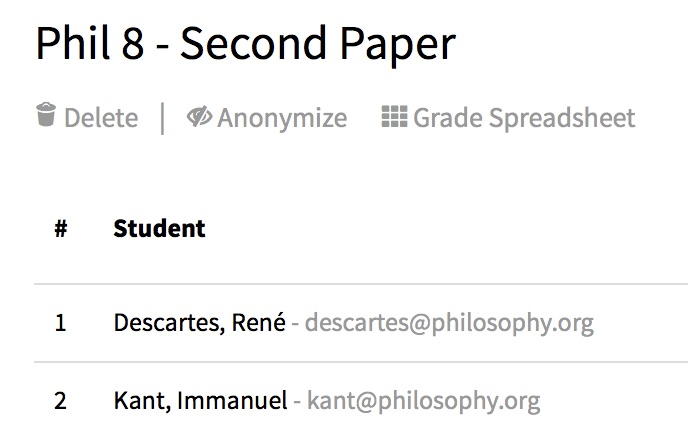
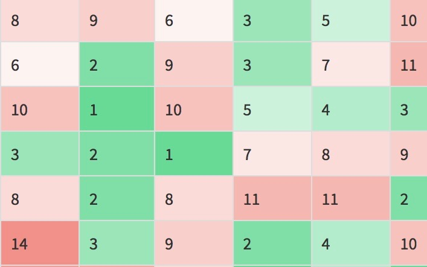
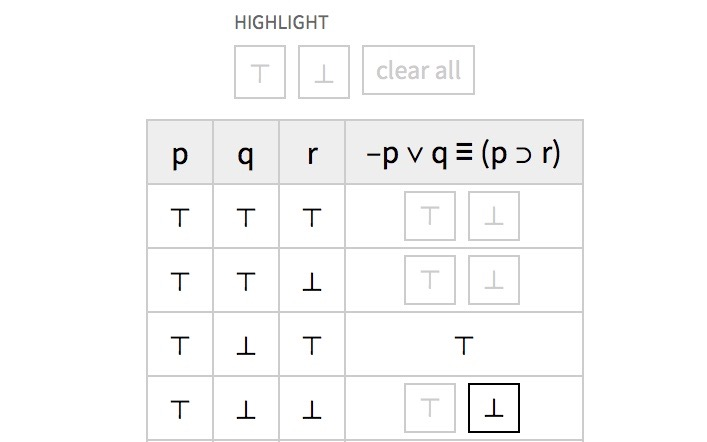

<h1>Tools</h1>

  

    
  

  

    
<a href="http://papergrader.org/demo">Paper Grader</a>

    
This is a tool that helps streamline the paper-grading process. Students submit their papers at a unique assignment URL, teachers mark them up online, and all papers get returned with one click.

  

  

    
  

  

    
GSI Assigner

    
As part of an effort by the Berkeley grad students to improve the way graduate student instructors (GSIs) are assigned to courses, I put together a website that collects teaching preferences and recommends optimal, stable assignments (using an algorithm inspired by work on the stable marriage problem).

    <!-- 
<a href="http://gsiassigner.herokuapp.com">View Website</a>
 -->
  

  

    
  

  

    
<a href="http://deductivelogic.org/psets/demo">deductivelogic.org</a>

    
I built this for Harvard's introductory deductive logic class. Teachers can create interactive problem sets that automatically check students work.

    <!-- 
<a href="http://deductivelogic.org"><i class="fa fa-external-link" aria-hidden="true"></i> Website</a> ・ <a href="http://deductivelogic.org/psets/demo"><i class="fa fa-external-link" aria-hidden="true"></i> Demo</a>
 -->
  

